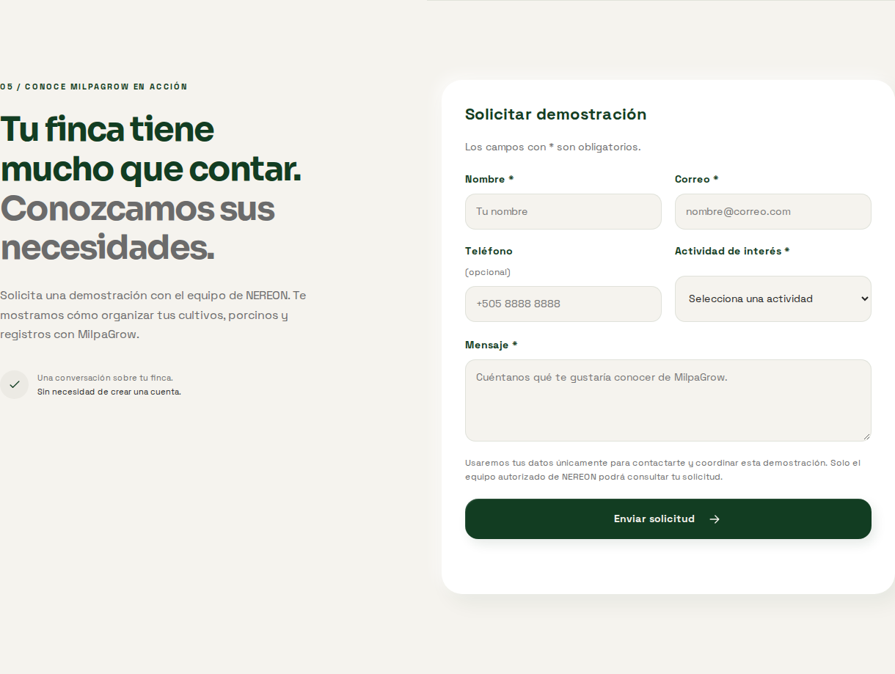
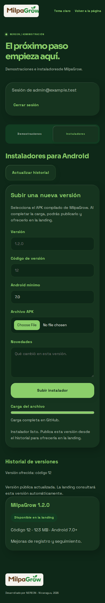

# Verificaciones del segundo sprint

Ejecutadas localmente el 8 de octubre de 2026. No se desplegó producción ni se
publicaron releases reales. Los recorridos del navegador usan contratos
simulados; la persistencia y autorización se comprobaron además en Firebase
Authentication y Firestore reales en su entorno emulado.

| Comprobación | Resultado |
| --- | --- |
| Configuración del build: URL, HTTPS y lista cerrada de valores públicos | 1 prueba Python aprobada, con múltiples casos |
| Chromium: ocho recorridos, escritorio y móvil | 16 pruebas aprobadas |
| Tamaños de landing | 320, 360, 390, 768, 900, 1024 y 1440 px sin desbordamiento horizontal |
| API existente + nuevas pruebas | 249 aprobadas, 0 fallidas; 3 integraciones omitidas fuera de emuladores |
| Integración nueva Auth/Firestore con APK real | 9 aprobadas, 0 omitidas |
| Patch transportable del backend | `git apply --check` correcto sobre MilpaGrow `develop` revisado |
| Sintaxis / revisión de cambios | JavaScript, Python y `git diff --check` correctos |

## Flujos comprobados

- Landing: pestañas originales, ejemplos de Milpi, menú móvil, tema persistente,
  consulta dinámica de versión, estado sin versión y error de descarga.
- Demo: validación del navegador y servidor; envío sin cuenta; confirmación sólo
  tras guardar; campos conservados tras desconexión; misma clave al reintentar;
  deduplicación concurrente; honeypot, desafío temporal y límites persistentes.
- Acceso: código de correo existente, canje con Firebase, denegación de todas
  las operaciones sin permiso, denegación sin código/correo verificado, descarte
  de una verificación pendiente al cambiar de cuenta y revocación inmediata.
- Solicitudes: lectura, detalles, filtro, cinco estados, notas, listas vacías,
  persistencia y conflicto al guardar una revisión antigua.
- Instaladores: selección de archivo, envío de bytes, progreso y confirmación;
  reintento de carga fallida conservando versión/datos; APK falso rechazado;
  carga de APK real, hash, publicación e historial; selección de versión anterior.
- Fallos GitHub: carga/publicación incompleta o fallida no cambia el manifest;
  rechaza repositorio privado y asset incompleto. El transporte usa el token sólo
  en headers del servidor.
- Accesibilidad: foco visible, teclado en pestañas, labels y estados anunciados,
  animaciones desactivadas con preferencia de movimiento reducido.
- Firestore: clientes directos sin acceso a las nuevas colecciones, incluso con
  una sesión administrativa.

## Cómo repetir

En MilpaWeb:

```bash
npm ci
npx playwright install chromium
npm test
```

Si se necesita un directorio de navegador alternativo, usar
`PLAYWRIGHT_BROWSERS_PATH` tanto al instalar como al ejecutar. En esta sesión se
utilizó `/tmp/milpagrow-sprint2-browsers`.

En MilpaGrow, sobre la rama del backend:

```bash
npm ci --prefix server
npm test --prefix server
MILPAGROW_TEST_APK=/ruta/MilpaGrow.apk firebase emulators:exec \
  --only auth,firestore --project demo-milpagrow \
  --config firebase.emulators.json \
  'node --test server/test/website.integration.test.js'
```

Las pruebas emuladas eliminan variables de credenciales Admin y usan sólo el
proyecto demo. El archivo APK real se recibe por una variable de prueba y no se
incluye en Git. No proporcionar secretos de producción a esta ejecución.

## Evidencia visual

Capturas con datos ficticios de los recorridos automatizados:





## Aceptación pendiente en producción

Configurar y desplegar la API y landing; verificar Brevo y el código real;
habilitar la cuenta administrativa; desplegar índices; subir/publicar un APK con
GitHub real y descargarlo sin sesión. Los pasos completos están en
[INTEGRACION_MILPAGROW.md](INTEGRACION_MILPAGROW.md). La validación estructural del
APK no certifica su firma: el administrador usa el build del proyecto y registra
los metadatos que le corresponden.
